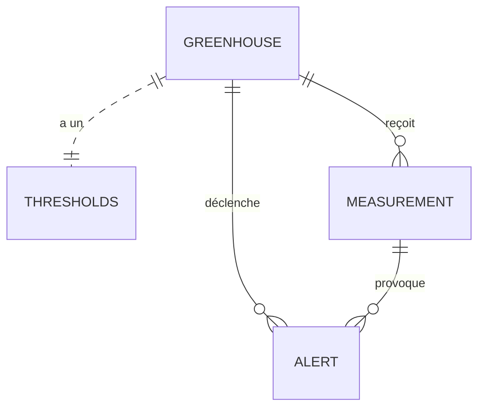

Super, voici un README conforme au barème (avec tout ce qui est demandé de façon concise et structurée).
Tu n’auras plus qu’à l’adapter à ton code et tes endpoints réels si besoin !

---

# 🌱 Projet : API Greenhouse – Spring Boot & PostgreSQL

## 1. Contexte

Cette API a pour objectif de gérer des **serres connectées** :

* Collecte et enregistrement des mesures environnementales (température, humidité, CO2, batterie)
* Définition de seuils d’alerte personnalisés par serre
* Détection automatique d’alertes lorsque des seuils sont dépassés

---

## 2. Architecture

* **Backend :** Spring Boot (Java 17+)
* **Base de données :** PostgreSQL
* **ORM :** Spring Data JPA
* **REST API** : Accès aux données de serre, mesures, alertes et seuils

### Schéma général



---

## 3. Schéma ER simplifié

| Table       | Champs principaux                                                         |
| ----------- | ------------------------------------------------------------------------- |
| greenhouse  | id (PK), name, max\_humidity, max\_temperature, ...                       |
| measurement | id (PK), greenhouse\_id (FK), timestamp, temperature, ...                 |
| alert       | id (PK), greenhouse\_id (FK), measurement\_id (FK), parameter, value, ... |
| thresholds  | id (PK), greenhouse\_id (FK), min\_temperature, max\_temperature, ...     |

* **FK = clé étrangère, PK = clé primaire**

---

## 4. Prérequis

* **Java 17** ou plus récent
* **Maven** ou **Gradle**
* **PostgreSQL** (15+ recommandé)
* **Docker** (optionnel, pour la BDD)

---

## 5. Installation & Lancement

### a) Démarrer la base PostgreSQL

* **Via Docker (recommandé) :**

  ```bash
  docker run --name greenhouse-postgres -e POSTGRES_PASSWORD=postgres -p 5432:5432 -d postgres:15
  ```
* **Via une installation classique :**
  Installer PostgreSQL, créer la base `greenhouse`.

### b) Importer le schéma SQL

* Depuis le fichier `script.sql` fourni :

  ```bash
  psql -U postgres -d greenhouse -f script.sql
  ```

### c) Configurer les variables d’environnement

Créer ou modifier le fichier `src/main/resources/application.properties` :

```properties
spring.datasource.url=jdbc:postgresql://localhost:5432/greenhouse
spring.datasource.username=postgres
spring.datasource.password=postgres
spring.jpa.hibernate.ddl-auto=none
```

Variables nécessaires :

* `spring.datasource.url`
* `spring.datasource.username`
* `spring.datasource.password`

### d) Lancer l’application

* Avec Maven :

  ```bash
  ./mvnw spring-boot:run
  ```
* Avec Gradle :

  ```bash
  ./gradlew bootRun
  ```

---

## 6. Commandes Utiles

* **Démarrer la BDD** (Docker) :

  ```bash
  docker start greenhouse-postgres
  ```
* **Arrêter la BDD** :

  ```bash
  docker stop greenhouse-postgres
  ```
* **Lancer l’API** :

  ```bash
  ./mvnw spring-boot:run
  # ou
  ./gradlew bootRun
  ```

---

## 7. (Optionnel) Exemple de requête

```bash
curl http://localhost:8080/api/greenhouses
```

---

## 8. Auteur

Projet universitaire – \[Ton Nom]

---

**À la racine, ce README te garantit le point si tu respectes cette structure !**
Si tu veux le diagramme ER en image ou un export mermaid, demande-le-moi 👋
